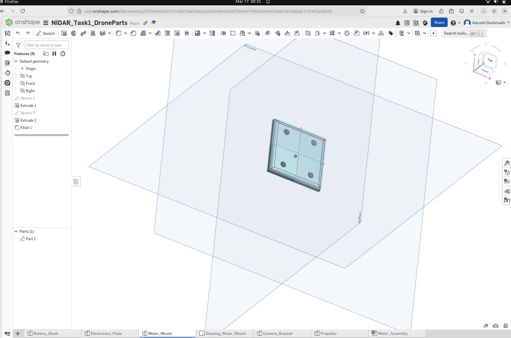
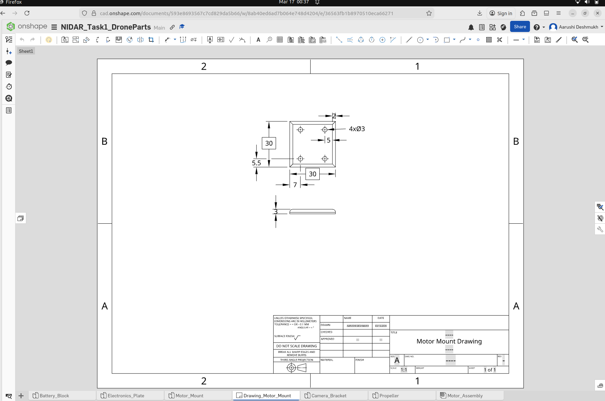
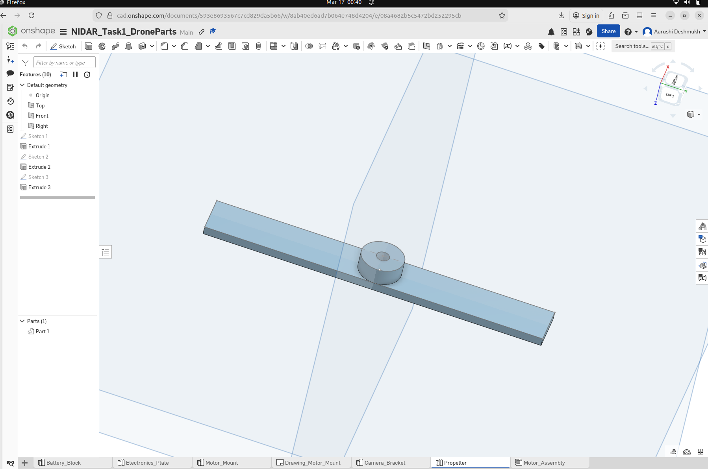
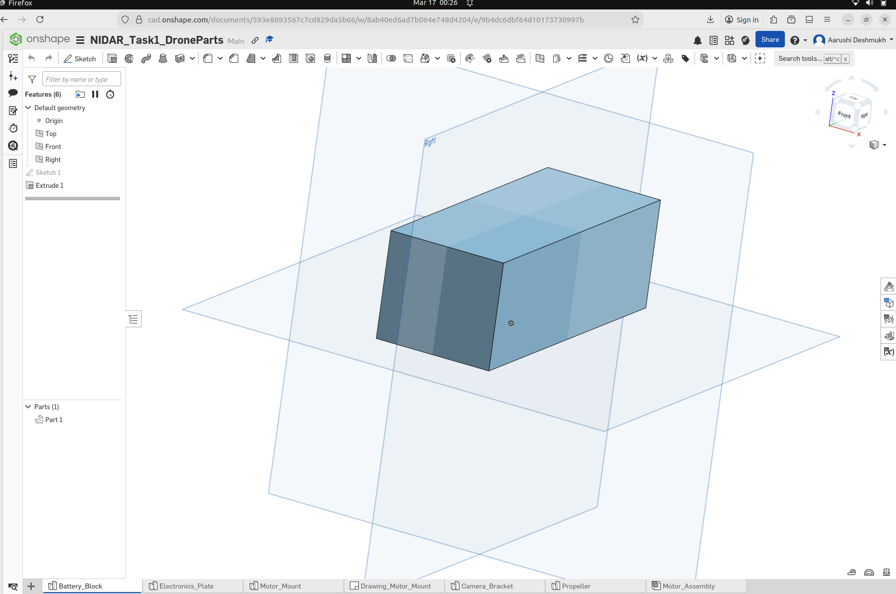
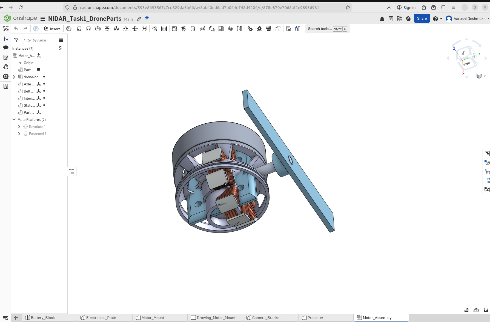
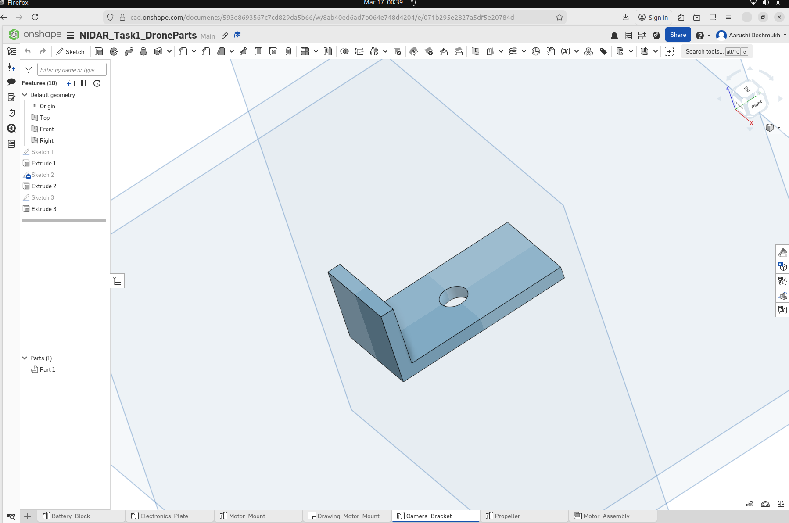
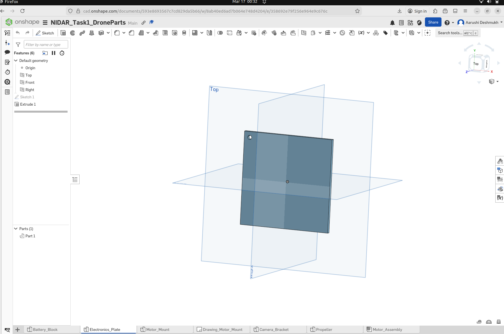
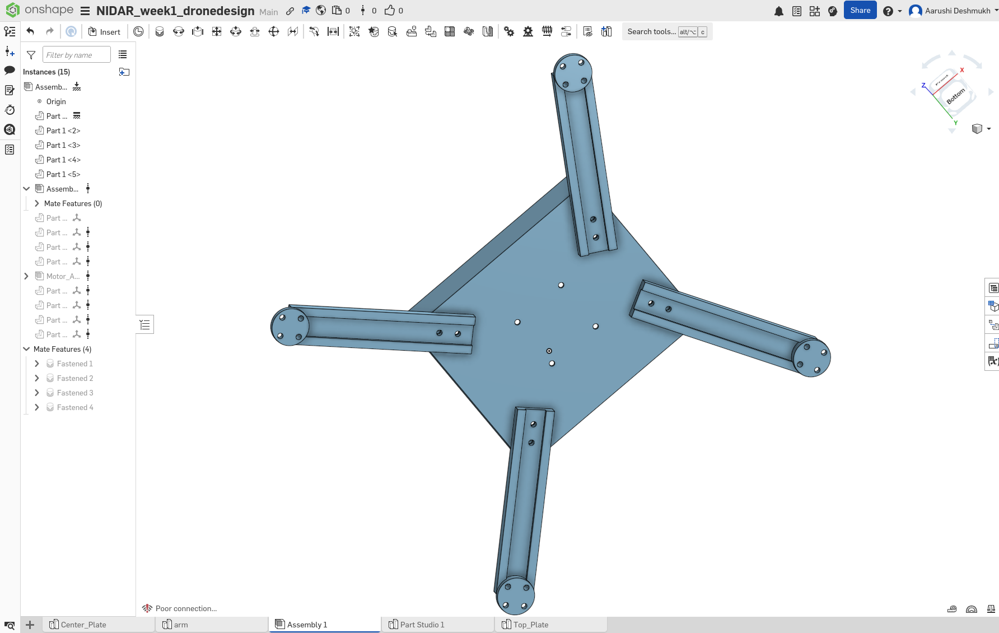
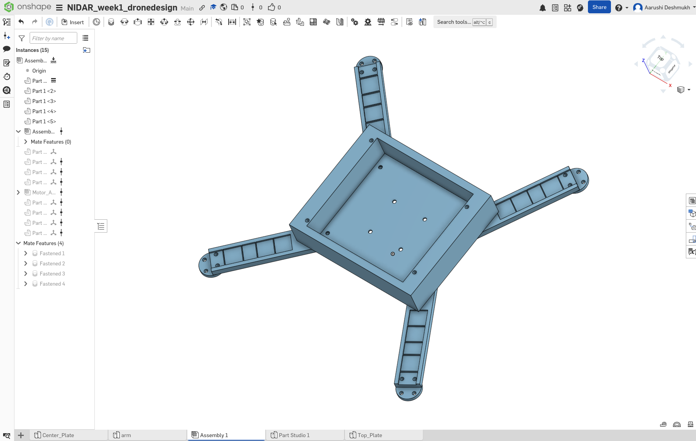

# 🚁 NIDAR Drone System Training

This repository contains my work for the **NIDAR (National Innovation Challenge for Drone Application and Research)** Disaster Management Drone System training at RISC.

The project is divided into three main components:
- ROS2 software development  
- CAD design of drone components  
- Electronics design and integration  

---

# 📂 Repository Structure

## 🧠 ROS2 Packages
Location: `src/`

Contains the ROS2 code for the drone system.

### 📦 drone1_pkg
Nodes implemented:
- simple_node  
- altitude_publisher  
- altitude_subscriber  
- arm_server  
- arm_client  
- takeoff_node  
- waypoint_node  

### 📦 drone_sim
Contains ROS2 launch files to run multiple nodes.

---

# 📅 Week 0 – ROS2 Fundamentals

## Task 1 – ROS2 Workspace and Node

## Task 2 – Publisher and Subscriber Communication

## Task 3 – Service and Client Communication

## Task 4 – Launch File Execution

---

# 🛠️ CAD Designs

## 📅 Week 0  
Location: `cad/week0`

### Motor Mount

### Motor Mount Drawing

### Propeller

### Battery Block

### Motor Assembly

### Camera Bracket

### Electronics Plate

---

## 📅 Week 1  
Location: `cad/week1`

### Basic Drone Model (Front)

### Basic Drone Model (Back)

👉 [Onshape Project Link](https://cad.onshape.com/documents/a0f7c9af46a198cc56af469d/w/b3925598f5c5c9bbdfd05818/e/9312e9408b08bb7651e16f4f?renderMode=0&uiState=69c16d33fed5b8f664953900)
---

# 🔗 Onshape CAD Link

View full CAD models here:  
👉 [Onshape Project Link](PASTE_YOUR_LINK_HERE)

---

# ⚙️ System Architecture & Electronics

📄 [Mission and System Architecture](electronics/MissionAndSystemArchitecture.pdf)  
📄 [Electronics – Week 1](electronics/nidar_week1.pdf)

---

# 👩‍💻 Author

**Aarushi**  
NIDAR Drone Training Project